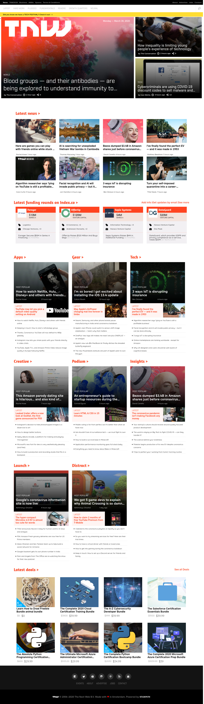

<a name="readme-top"></a>

<div align="center">
  

  <br/>

  <h3><b>Code Review - TNW Clone (Old version)</b></h3>

</div>

# 📗 Table of Contents

- [📖 About the Project](#about-project)
  - [🛠 Built With](#built-with)
  - [🚀 Live Demo](#live-demo)
- [💻 Getting Started](#getting-started)
  - [Setup](#setup)
  - [Prerequisites](#prerequisites)
  - [Install](#install)
  - [Usage](#usage)
  - [Run tests](#run-tests)
- [👥 Authors](#authors)
- [🤝 Contributing](#contributing)
- [📝 License](#license)

# 📖 [TNW - Clone (Old version)] <a name="about-project"></a>

> This is a copy of and old clone of The Next Web.

In this project, we build a responsive clone of The Next Web, a tech-focused magazine which uses media queries to gracefully degrade their site as the window size is reduced.

3 viewports are available:

- Small (max-width: 768px)
- Medium (min-width: 768px and max-width: 1024px)
- Large (min-width: 1024px)

## 🛠 Built With <a name="built-with"></a>

- Only HTML & CSS used
- Flexbox & Grid

## 🚀 Live Demo <a name="live-demo"></a>

[Original version](http://web.archive.org/web/20200725041701/https://thenextweb.com/)

[Live Demo Link](https://marcoshdezcam.github.io/gh-pages-lives/P6_TNW_Responsive/)



<p align="right">(<a href="#readme-top">back to top</a>)</p>

<!-- GETTING STARTED -->

## 💻 Getting Started <a name="getting-started"></a>

To get a local copy up and running, follow these steps.

### Prerequisites

In order to run this project you only need a web browser.

### Setup

Clone this repository to your desired folder:

Example commands:

```sh
  cd my-folder
  git clone git@github.com:marcoshdezcam/tnw-code-review.git
```

### Usage

To run the project, open the index.html file with your favorite web browser.

<p align="right">(<a href="#readme-top">back to top</a>)</p>

## 👥 Authors <a name="authors"></a>

👤 **Marcos Hernández Campos**

- Github: [@marcoshdezcam](https://github.com/marcoshdezcam)
- Twitter: [@MarcosHCampos](https://twitter.com/MarcosHCampos)
- Linkedin: [Marcos Hernández](https://linkedin.com/marcos-hernández-56058119a/)

👤 **Jorge Cerón**

- GitHub: [@duducus](https://github.com/duducus)
- Twitter: [@jorgeceron](https://twitter.com/jorgeceron1)
- Linkedin: [Jorge Francisco Ceron](https://mx.linkedin.com/in/jorge-francisco-cer%C3%B3n-gil-343583113)

<p align="right">(<a href="#readme-top">back to top</a>)</p>

## 🤝 Contributing <a name="contributing"></a>

Contributions, issues, and feature requests are welcome!

Feel free to check the [issues page](../../issues/).

<p align="right">(<a href="#readme-top">back to top</a>)</p>

## 📝 License <a name="license"></a>

This project doesn't require a license.
